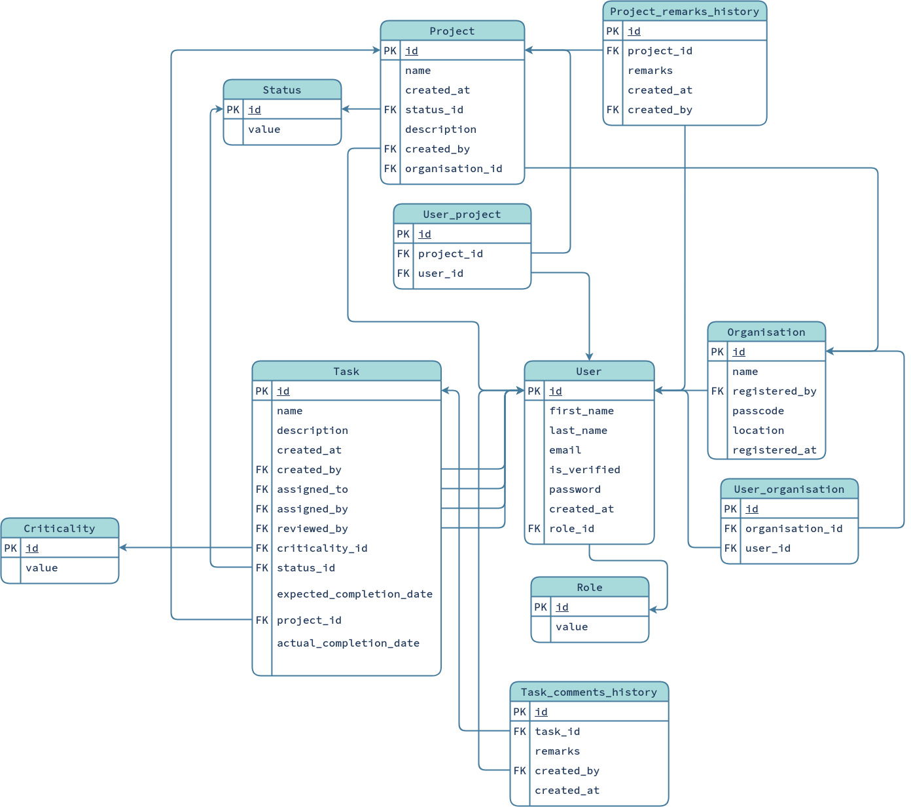

# Py-iTrack
A Simple Task Tracker Backend using ReST APIs written in Flask.

## Database-Schema


## Project Structure
```bash
.
├── LICENSE
├── README.md
├── requirements.txt
├── resources
│   ├── development.ini
│   └── production.ini
└── src
    ├── app.py
    ├── commands
    │   ├── __init__.py
    │   └── tables.py
    ├── controllers
    │   ├── __init__.py
    │   ├── organisation.py
    │   └── user.py
    ├── main.py
    ├── models
    │   ├── association.py
    │   ├── __init__.py
    │   ├── mixins.py
    │   ├── organisation.py
    │   ├── project.py
    │   ├── static.py
    │   ├── task.py
    │   └── user.py
    ├── routes
    │   ├── __init__.py
    │   ├── organisation.py
    │   └── user.py
    ├── serializers
    │   ├── __init__.py
    │   ├── organisation.py
    │   └── user.py
    └── utils
        ├── helpers.py
        ├── __init__.py
        ├── misc_instances.py
        └── serializer.py
```
